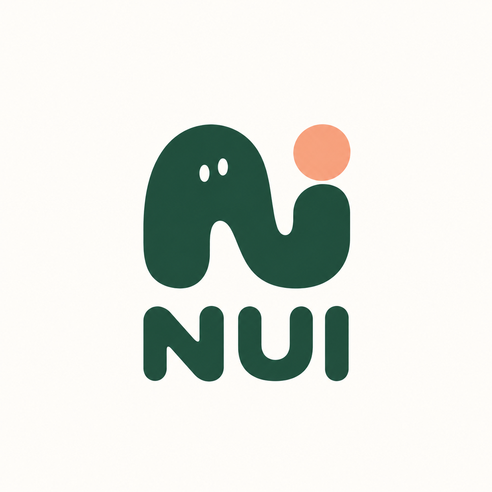

<p align="center">
  
</p>

# Needless UI

**The Needlessly Engineered Styling Toolkit.** An open-source UI component library for Angular, with React next. The name is a joke; the engineering isn't.

> Early development (`0.x`). APIs will change between minor versions until 1.0.

## Why another component library

- **Native elements first.** `<button nuiButton>` is a real `<button>`: native semantics, keyboard behavior and forms, with nothing wrapped around it.
- **One stylesheet for every framework.** Components are styled by a framework-free CSS package. Angular and React bindings only set classes and `data-*` attributes, so both frameworks look and behave the same.
- **Your CSS always wins.** Everything ships inside `@layer nui.*`, so plain CSS in your app overrides it without `!important` or specificity battles.
- **Accessible by construction.** Every color pair is checked against WCAG 2.2 AA when the palette is generated. Controls clear the 24px target minimum, and focus rings, forced colors and reduced motion are handled.
- **Needlessly customizable.** Springs, press effects, entrances, corner shapes, radius and density: one attribute for a whole subtree, or one input per component. The springs are real physics, solved at build time and shipped as CSS `linear()` easings.
- **Standard design tokens.** Tokens are W3C DTCG 2025.10 files, compiled to CSS custom properties with light and dark modes, including nested themes.
- **Modern Angular.** Signal inputs, zoneless, OnPush, SSR- and hydration-safe, with one entry point per component so apps only ship what they import.

## Packages

| Package                                    | What it is                                                             |
| ------------------------------------------ | ---------------------------------------------------------------------- |
| [`@needless-ui/tokens`](packages/tokens)   | Design tokens in DTCG format, compiled to CSS custom properties        |
| [`@needless-ui/css`](packages/css)         | Framework-free component styles in cascade layers; works in plain HTML |
| [`@needless-ui/angular`](packages/angular) | Angular 22 directives and components that apply those styles           |
| `@needless-ui/react`                       | Planned                                                                |

## Components

[AI chat](specs/chat.md), [Avatar](specs/avatar.md), [Breadcrumbs](specs/breadcrumbs.md), [Button](specs/button.md), [Calendar](specs/calendar.md), [Color picker](specs/color-picker.md), [Combobox](specs/select.md), [Command palette](specs/command.md), [Data grid](specs/grid.md), [Date and time pickers](specs/date-picker.md), [Dialog](specs/dialog.md), [Dropzone](specs/dropzone.md), [Empty state](specs/empty.md), [Input mask](specs/mask.md), [Markdown](specs/markdown.md), [Menu](specs/menu.md), [Number field](specs/number-field.md), [OTP input](specs/otp.md), [Phone field](specs/phone-field.md), [Popover and hovercard](specs/popover.md), [Rating](specs/rating.md), [Scheduler](specs/scheduler.md), [Select](specs/select.md), [Skeleton](specs/skeleton.md), [Splitter](specs/splitter.md), [Toast](specs/toast.md) and [Tour](specs/tour.md) so far, with a carousel and a rich text editor on the way. Each spec defines the API, keyboard behavior and accessibility, and every framework package implements it.

## Quick start (Angular)

```bash
pnpm add @needless-ui/angular @angular/aria @angular/cdk
```

Import the styles once, in `src/styles.css`:

```css
@layer reset, nui, app; /* optional: keeps your resets from overriding components */
@import '@needless-ui/css';
```

Use a component:

```ts
import { Component } from '@angular/core';
import { NuiButton } from '@needless-ui/angular/button';

@Component({
  selector: 'app-root',
  imports: [NuiButton],
  template: `<button nuiButton variant="soft" tone="danger" (click)="remove()">Delete</button>`,
})
export class App {
  remove() {}
}
```

## Plain HTML

```html
<link
  rel="stylesheet"
  href="https://cdn.jsdelivr.net/npm/@needless-ui/css/dist/needless-ui.min.css"
/>

<button class="nui-button" data-variant="outline" data-tone="neutral">
  It works without a framework
</button>
```

## Customization

Any element can give everything inside it a personality, and components take the same values as inputs:

```html
<body data-nui-motion="jelly" data-nui-press="squish" data-nui-corners="squircle">
  <button nuiButton press="rubber" [spring]="{ stiffness: 900, damping: 12 }">Boing</button>
</body>
```

See the [customization spec](specs/customization.md), or play with it at [needlessui.com/guides/customization](https://www.needlessui.com/guides/customization).

## Theming

- **Light and dark** follow the operating system. Pin a theme on any element with `data-nui-theme="light"` or `"dark"`; themes can nest.
- **Override a token** anywhere, e.g. `:root { --nui-color-accent-solid: oklch(0.55 0.2 150); }`.
- **Change the brand palette** by editing the palette config in [`packages/tokens/scripts/palette.ts`](packages/tokens/scripts/palette.ts) and regenerating. Contrast is re-checked automatically.

## Repository layout

```
packages/
  tokens/      DTCG token sources, palette generator, token compiler
  css/         component styles (one file per component) and the bundler
  angular/     @needless-ui/angular, one secondary entry point per component
apps/
  docs/        the documentation site, www.needlessui.com (English and Italian)
specs/         framework-agnostic contract for each component
```

## Development

Requires Node.js 22.22+ or 24.15+ and pnpm 12.

```bash
pnpm install
pnpm dev        # docs site at http://localhost:4200
pnpm test       # token, CSS and Angular unit tests
pnpm build      # tokens → css → Angular package in dist/
pnpm build:docs # prerendered docs site in dist/docs/browser
```

See [CONTRIBUTING.md](CONTRIBUTING.md) before opening a pull request.

## License

[MIT](LICENSE)
